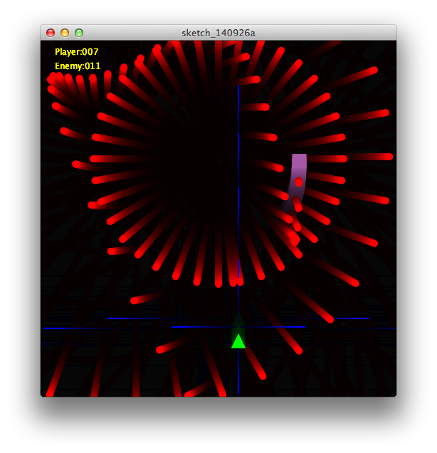

Processing-ShootingGame
=======================

Processingで簡単なシューティングゲームを作りました。

なお、[Newral技術者ブログ](http://newral.info/publics/index/79/&anchor_link=page79_341#page79_341)というサイトでプログラミングの過程を記事にしております。是非ご覧下さい。

###記事へのリンク  
[Processingでシューティング(Part1)](http://newral.info/publics/index/79/page341=2/r_id=206/c_id=341/detail=1/&anchor_link=page79_341_206#page79_341_206)  
[Processingでシューティング(Part2)](http://newral.info/publics/index/79/page341=2/r_id=210/c_id=341/detail=1/&anchor_link=page79_341_210#page79_341_210)  
[Processingでシューティング(Part3)](http://newral.info/publics/index/79/r_id=213/c_id=341/detail=1/&anchor_link=page79_341_213#page79_341_213)  
[Processingでシューティング(Part4)](http://newral.info/publics/index/79/r_id=215/c_id=341/detail=1/&anchor_link=page79_341_215#page79_341_215)  

###ソースコードガイド

ShootingGame.pde (上記記事でプログラミングしたソースコード)  

###実行方法

Processingの開発環境をインストールし、pdeファイルを読み込んでRunボタンを押す。
上下左右キーで自機を操作します。

または以下のリンクからブラウザでも実行できます。JavaScriptで動作します。

[ShootingGame](http://muratamuu.github.io/Processing-ShootingGame/index.html)

###おまけ編

Processingでもう一本プログラムを書きました。

[Rainbow Nyoro](http://github.com/muratamuu/Processing-RainbowNyoro)
